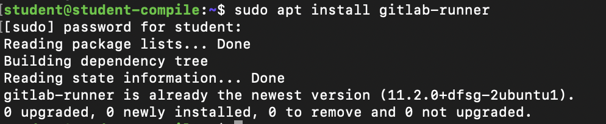
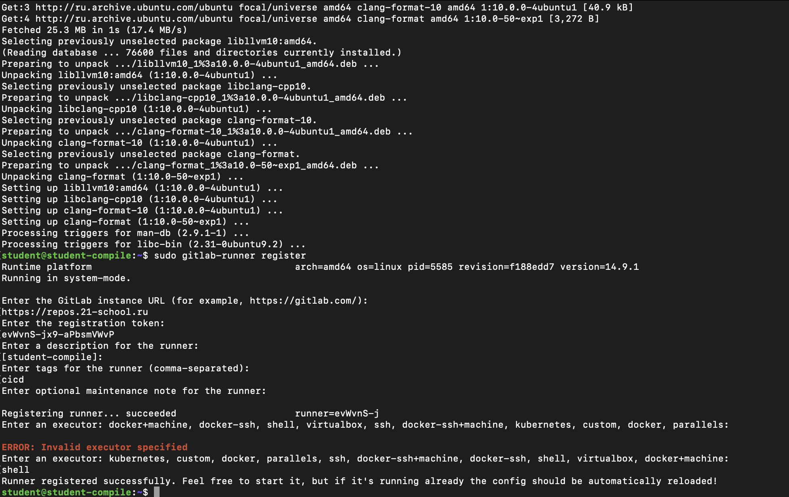
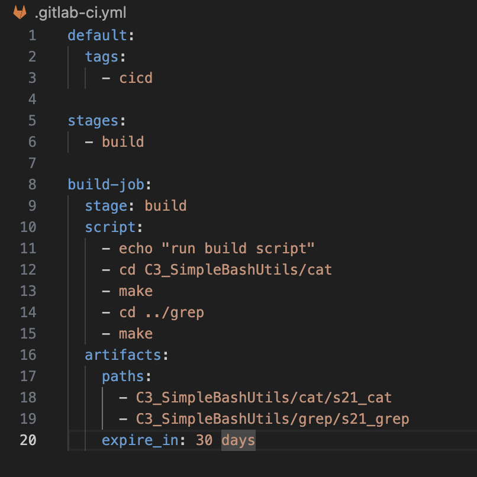
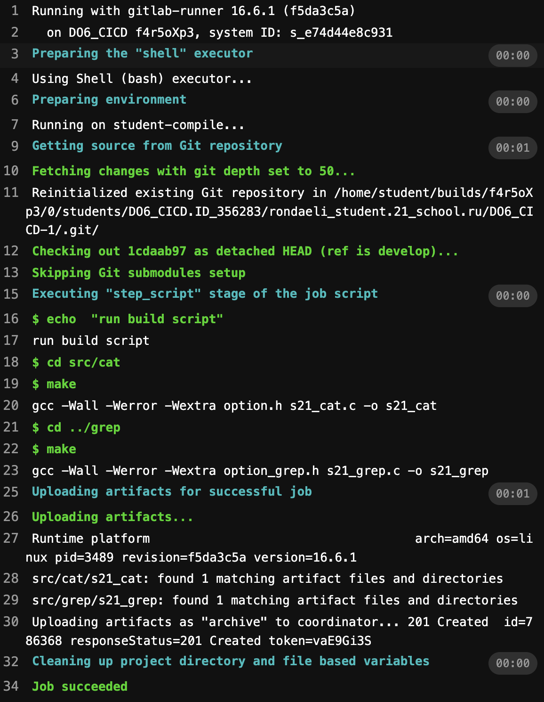
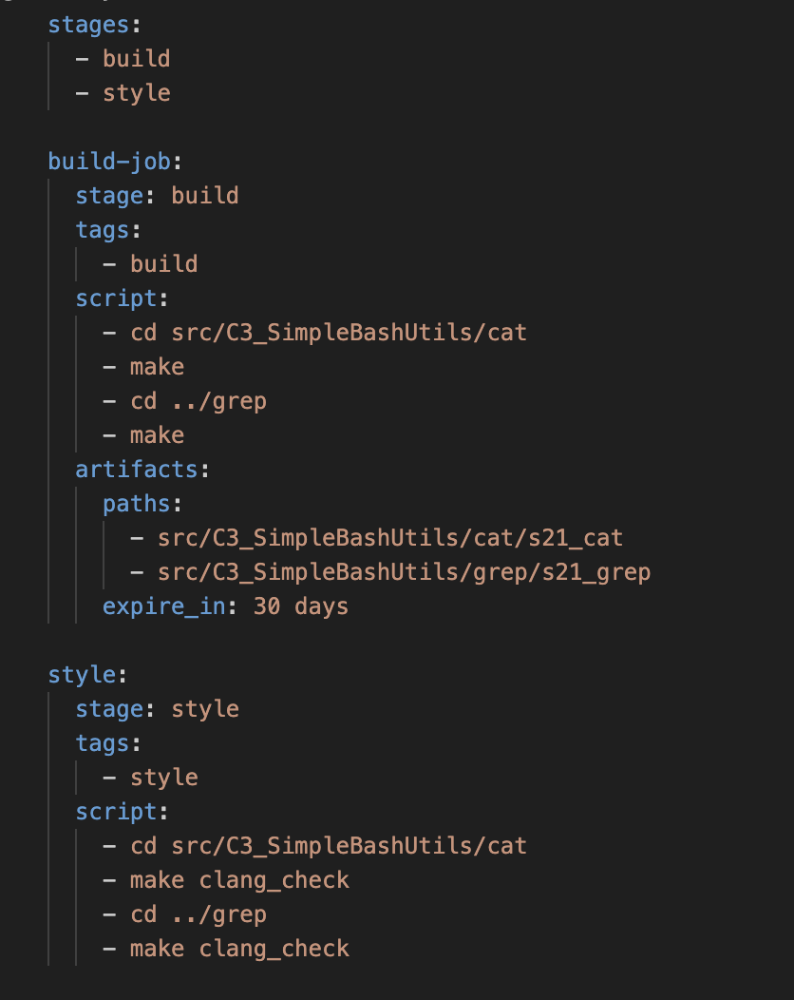

## Part 1. Настройка gitlab-runner

- Поднять виртуальную машину Ubuntu Server 20.04 LTS
    

- Скачать и установить на виртуальную машину gitlab-runner:
 `curl -L "https://packages.gitlab.com/install/repositories/runner/gitlab-runner/script.deb.sh" | sudo bash`
 `apt-cache madison gitlab-runner`
 `sudo apt-get install gitlab-runner=14.9.1`
- Устанавливаем все необходимые пакеты в Ubuntu:
`sudo apt install make`
`sudo apt install gcc`
`sudo apt install clang-format`
    

- Регистрируем проект:
`sudo gitlab-runner register, указываем URL, токен и тэг`
    
----

## Part 2. Сборка
- Этап по сборке приложений представлен в `.gitlab-ci.yml stage: build:`
    
- Запускаем на Ubuntu gitlab-runner командой `gitlab-runner run`
    

## Part 3. Тест кодстайла  
- Не забываем дописать этап в начало `.gitlab-ci.yml` 
     
    

# конец 