## Part 1. Установка ОС
- установили Ubuntu 20.04 Server LTS без графического интерфейса и выполнили команду `cat /etc/issue.`
- результат вывода коаманды 

    
---
## Part 2. Создание пользователя
- вызов команды для создания пользователя 
    
- резултат ввода команды `cat /etc/passwd`
    
- команда для проверки принадлежности нового пользователя к группе `adm`
    
---
## Part 3. Настройка сети ОС

##### Задать название машины вида user-1

- открываем `/etc/hostname` через редактор nano
    
- меняем название машины    
    
- открываем `/etc/hosts` через редактор nano
    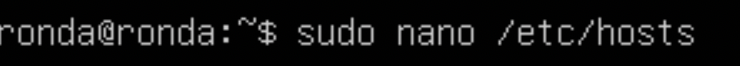
- меняем названи машины     
    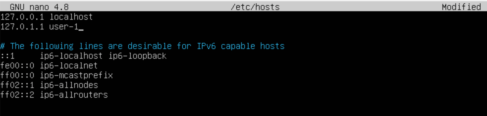
- перезагружаем
    
- проверяем
    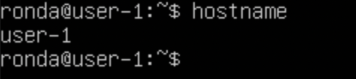

##### Установить временную зону
- команда для установки часового пояса
    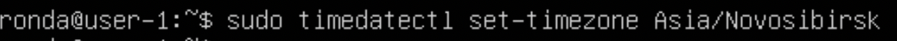
- проверяем 
    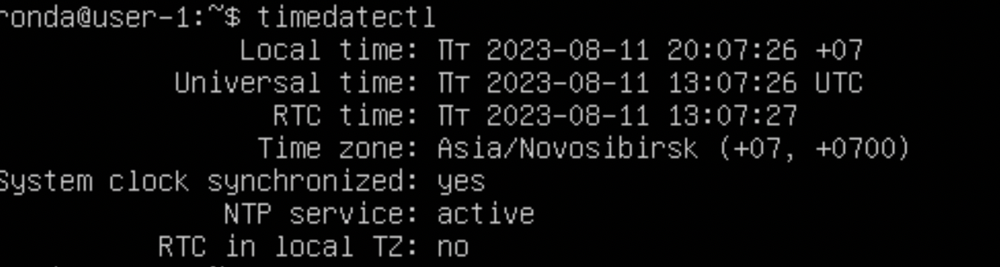

##### Вывод названия сетевых интерфейсов
- команды для вывода интерфейсов
    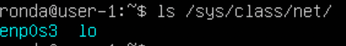
- lo (loopback device) – виртуальный интерфейс, присутствующий по умолчанию в любом Linux. Он используется для отладки сетевых программ и запуска серверных приложений на локальной машине. С этим интерфейсом всегда связан адрес 127.0.0.1. У него есть dns-имя – localhost.

##### Получение ip-aдреса 
- получение ip от сервера
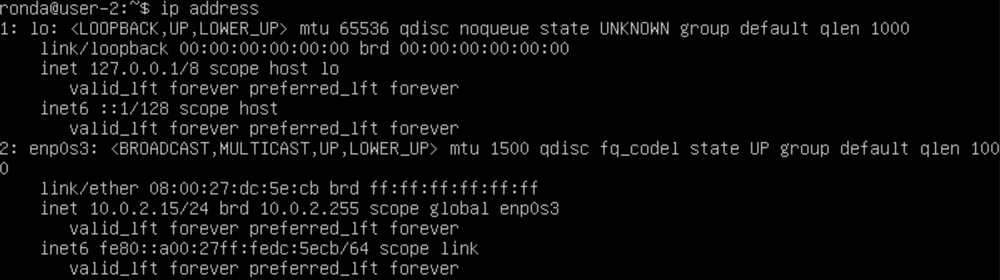
- DHCP (Dynamic Host Configuration Protocol — протокол динамической настройки узла) — сетевой протокол, позволяющий сетевым устройствам автоматически получать IP-адрес и другие параметры, необходимые для работы в сети TCP/IP.

##### Вывод на экран внешний ip-адрес шлюза (ip) и внутренний IP-адрес шлюза
- Команда для определения внешнего IP-адреса шлюза (ip)
    
- Для определения внутреннего IP-адреса шлюза (gw):
    

##### Задать статичные настройки ip, gw, dns
- открываем файл через редактор
    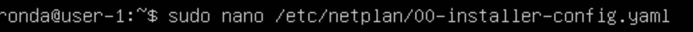
- задаем стат. настройки
    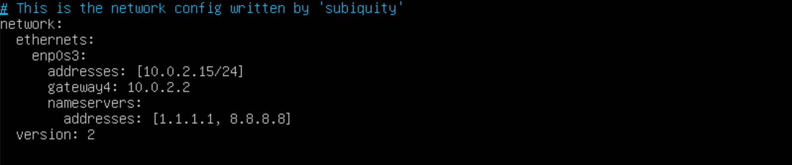
- применяем внесенные уведомления 
    
- пингуем 
    
---

## Part 4. Обновление ОС
- команда для обновления 
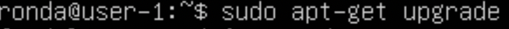
- результат выполнения команды
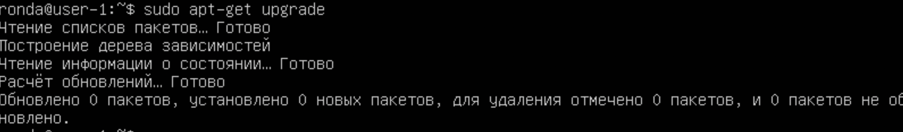
---

## Part 5. Использование команды sudo
- команда для выдачи прав sudo
    
- Команда sudo предоставляет возможность пользователям выполнять команды от имени суперпользователя root, либо других пользователей.
- проверка что у пользователя есть права 
    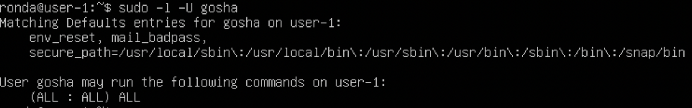
- смена пользователя и команада для смены  `hostname`    
    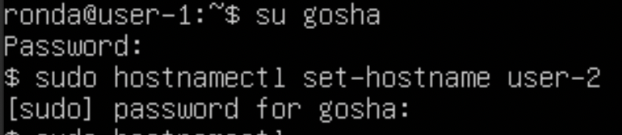
- измененный `hostname`
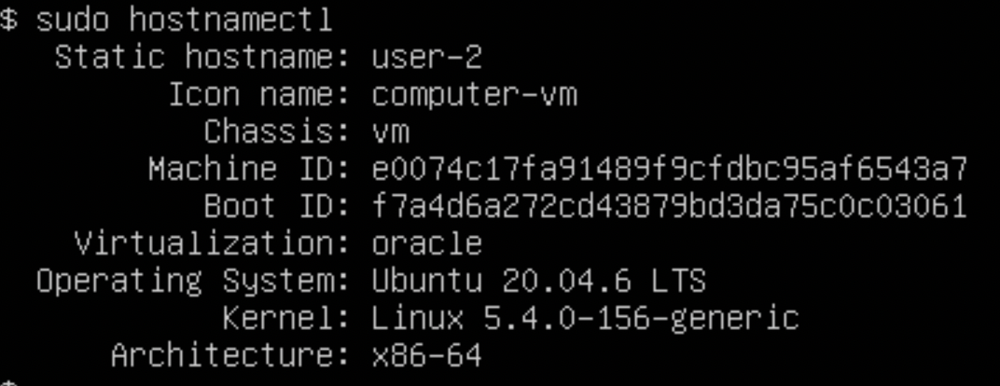
---
## Part 6. Установка и настройка службы времени
- вывод времени в котором находимся 
    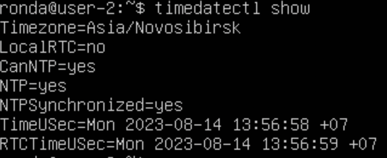
- корректное время 

---

## Part 7. Установка и использование текстовых редакторов
##### Установить текстовые редакторы VIM + NANO + JOE
- устанавливаем vim
    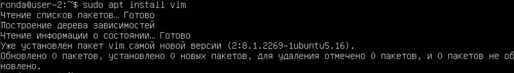
- устанавливаем nano и joe 
    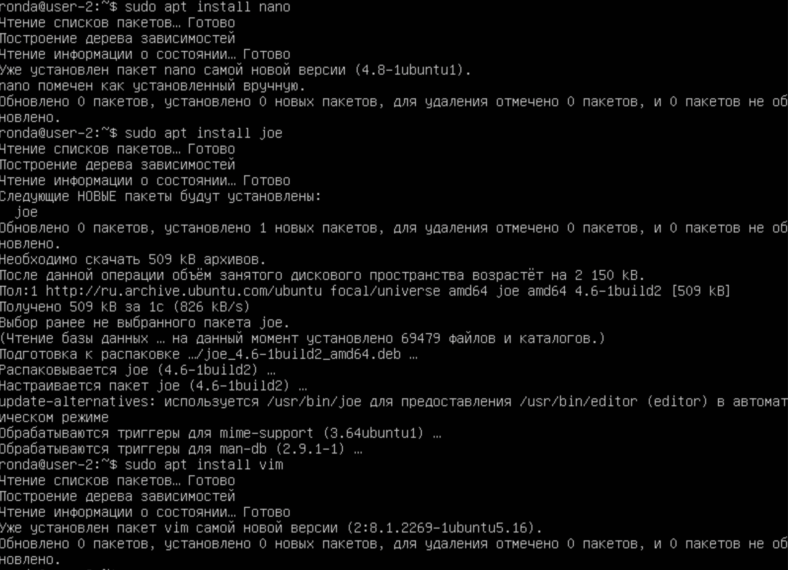

##### Создайте файл test_X.txt, где X -- название редактора
- VIM:
    - содержимое редактора vim
    - Для выхода и сохранения необходимо нажать `Esc` и `:wq`:
    
- NANO:
    - содержимое редактора nano
    - NANO: для выхода и сохранения необходимо нажать `CTRL-X` и `Y`:
    

- JOE:
    - содержимое редактора joe
    - Для выхода и сохранения необходимо нажать `CTRL-K +X`
    
- проверяем что все 3 файла существуют
    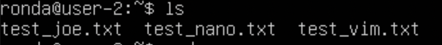

##### Файл на редактирование
- VIM:
    - для выхода без сохранения необходимо нажать `Esc` и `:q!`:
    
- NANO:
    - для выхода без сохранения необходимо нажать `CTRL-X` и `N`:
    
- JOE: 
    - JOE: для выхода без сохранения необходимо нажать `CTRL +С` и `Y`:
    

##### Поиск и замена 
- JOE:
    - для поиска необходимо нажать `CTRL-K +F`, ввести необходимое слово и нажать `I`:
    
    - для замены необходимо нажать `CTRL-K +F`, ввести слово для поиска и нажать `R`, затем ввести слово на замену:
    
- NANO:
    - для поиска необходимо нажать `CTRL-W` и ввести необходимое слово:
    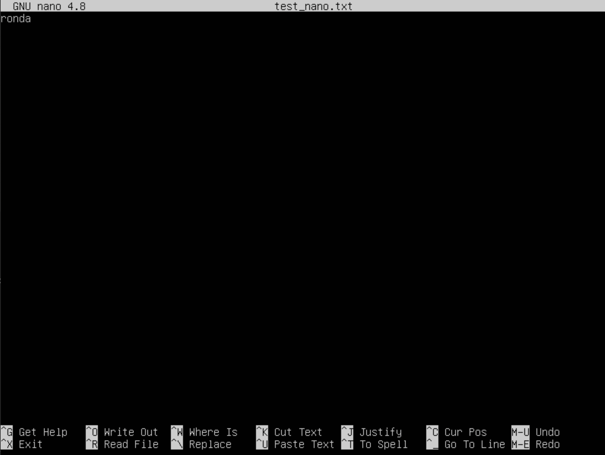
    -  для замены необходимо нажать `CTRL +/`, ввести слово для поиска и нажать `Entr`, затем ввести слово на замену, нажать `Entr` и `Y`:
    
- VIM:
    - для поиска необходимо нажать `/` и ввести необходимое слово:
    
    - для замены необходимо нажать `:s/`, ввести необходимое для замены слово, `/`, заменяемое слово:
    
---
## Part 8. Установка и базовая настройка сервиса SSHD
- установка службы sshd
    
- Добавление автостарта службы SSHd при загрузке системы.
    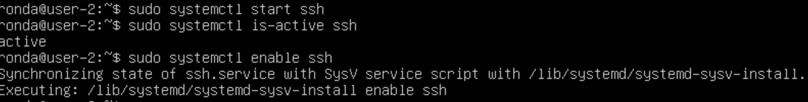
- Перенастройка службы SSHd на порт 2022 с помощью редактора nano в файле `/etc/ssh/sshd_config.`
    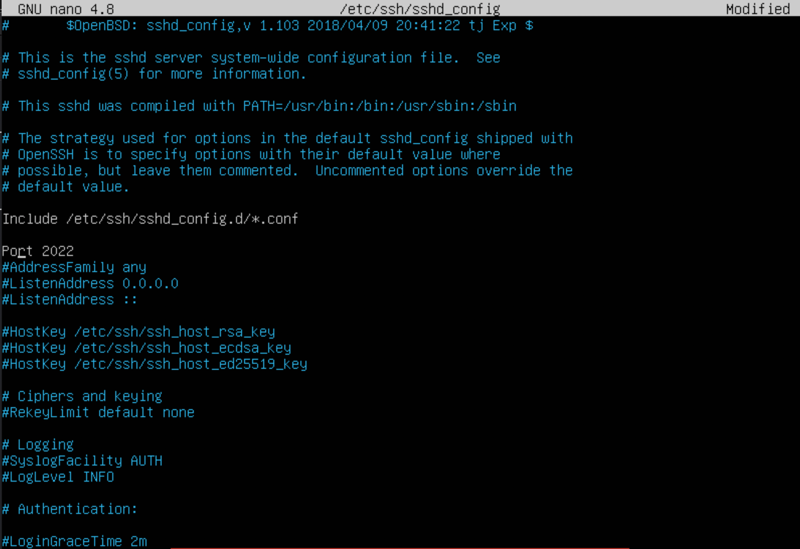
- Перезагрузка системы (reboot).
- наличие процесса sshd
    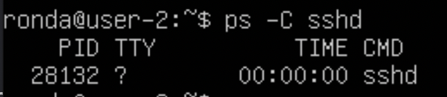
- Команда ps выводит список текущих процессов на сервере в виде таблицы.
- флаг -С выбирать процессы по имени команды
- sshd название процесса
- Вывод команды `netstat -tan` 
    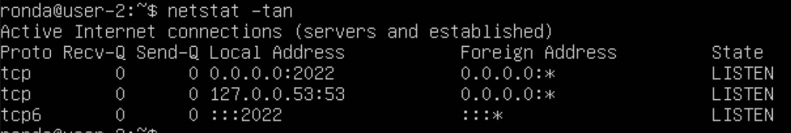
- Значение ключей -tan, значение каждого столбца вывода, значение 0.0.0.0:
- `-t` - перечисление всех TCP портов;
- `-a` - отображение списка всех портов;
- `-n` - вывод значений в цифровом формате (покажет IP-адрес вместо хоста, номер порта вместо имени порта, UID вместо имени пользователя). 
- `Proto` - протокол, используемый сокетом;
- `Recv-Q` - счётчик байтов не скопированных программой пользователя из этого сокета;
- `Send-Q` - счётчик байтов, не подтверждённых удалённым узлом;
- `Local Address` - адрес и номер порта локального конца сокета;
- `Foreign Address` - адрес и номер порта удалённого конца сокета;
- `State` - состояние сокета;
- `LISTEN` - сокет ожидает входящих подключений;
- `TIME_WAIT` - сокет находится в состоянии ожидания после закрытия для обработки пакетов всё ещё находящихся в сети.
- 0.0.0.0 - это немаршрутизируемый адрес IPv4, который используется в качестве адреса по умолчанию или адреса-заполнителя.
---

## Part 9. Установка и использование утилит top, htop 
##### top 
- установка htop
    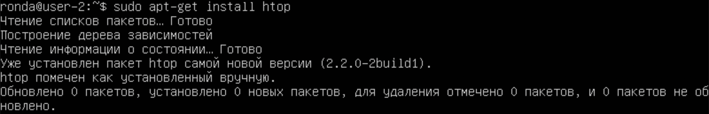
- установка top
    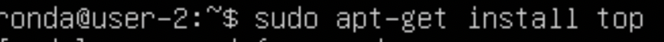
- uptime,количество авторизованных пользователей и общая загрузка системы:
    
- общее количество процессов и загрузка cpu
    
- загрузка памяти:
    
- pid процесса, занимающего больше всего процессорного времени
    
- pid процесса занимающего больше всего памяти
    
##### htop
- вывод команды htop отсортированному по PID
    
- вывод команды htop отсортированному по PERCENT_CPU
    
- вывод команды htop отсортированному по PERCENT_MEM
    
- отсортированному по TIME
    
- отфильтрованному для процесса sshd
    
- с процессом syslog, найденным, используя поиск
    
- с добавленным выводом hostname, clock и uptime
    
---
## Part 10. Использование утилиты fdisk
- вывод команды `fdisk -l`
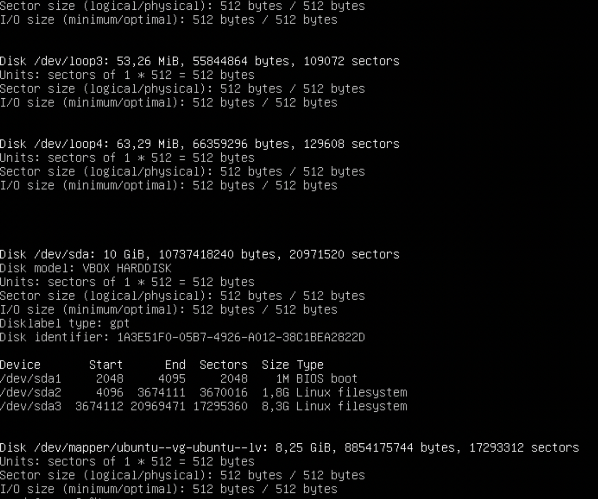
- Название жесткого диска: /dev/sda
- Размер: 10 Gb
- Количество секторов жесткого диска: 20971520
- команда для просмотра `swap`
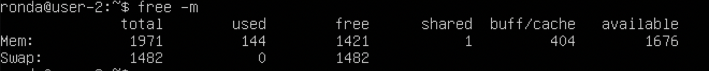
- размер swap: 1482
---
## Part 11. Использование утилиты df
- Запуск команды df
    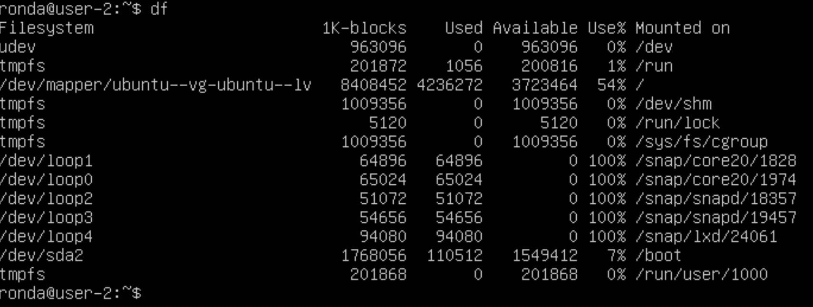
- Запуск команды df для корневого раздела (/)
    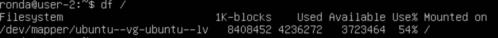
    - размер раздела :8408452 
    - размер занятого пространства :4236272
    - размер свободного пространства :3723464
    - процент использования :54%
    - eдиница измерения в выводе: Kb.
- Запуск команды df -Th.
    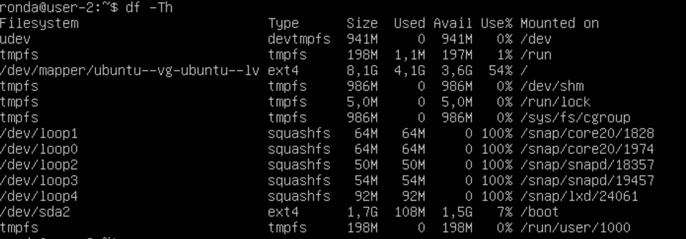
- Запуск команды df -Th для корневого раздела (/)
    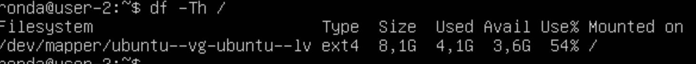
    - размер раздела : 8.1g
    - размер занятого пространства :4.1g
    - размер свободного пространства :3.6g
    - процент использования :54%
    - тип файловой системы для раздела :ext4.
---
## Part 12. Использование утилиты du
- Запуск команды du
    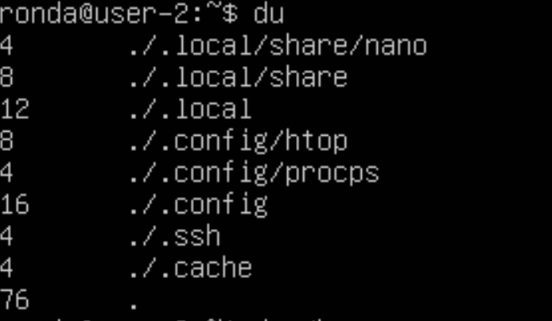
- Вывод размера папок /home, /var, /var/log в человекочитаемом виде:
    
- Вывод размера папок /home, /var, /var/log в байтах:
    
- Вывод размера всего содержимого в /var/log:
    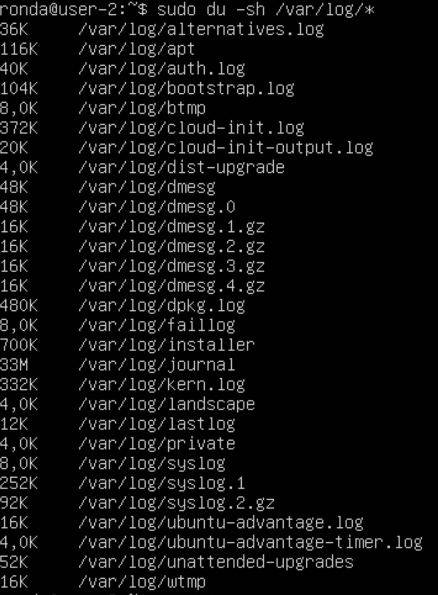
---
## Part 13. Установка и использование утилиты ncdu
- установка ncdu:
    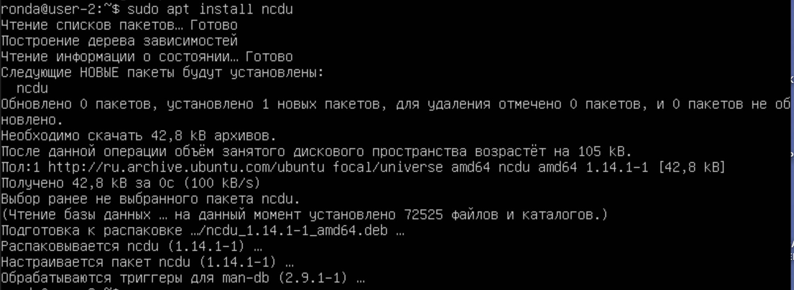
- Вывод размера папки /home:
    
- Вывод размера папки /var:
    
- Вывод размера папки /var/log:
    
- команда для вывода размера папки /home:
    
- команда для вывода размера папки /var:
    
- команда для вывода размера папки /var/log:
    
---
## Part 14. Работа с системными журналами
- Открытие для просмотра /var/log/dmesg:
    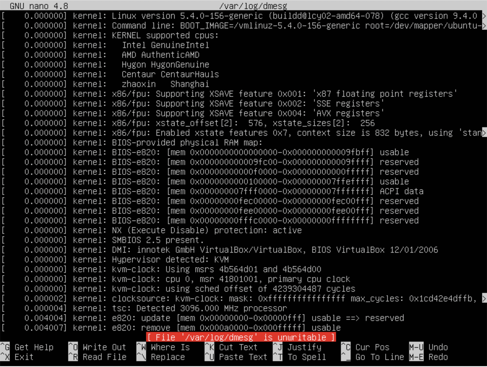
- Открытие для просмотра /var/log/syslog
    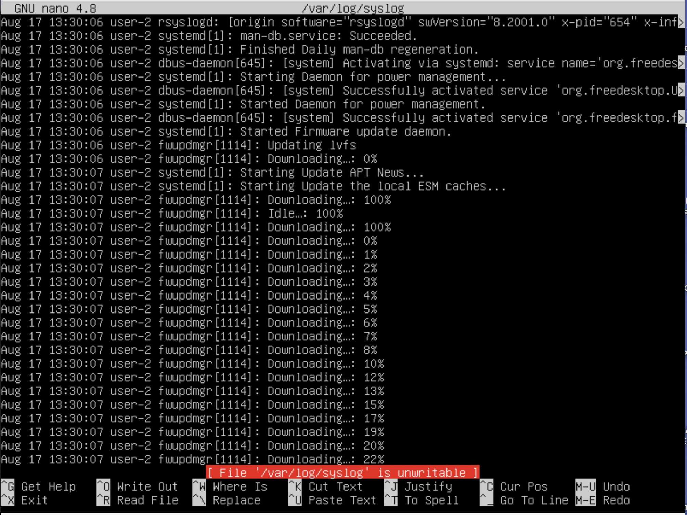
- Открытие для просмотра /var/log/auth.log
    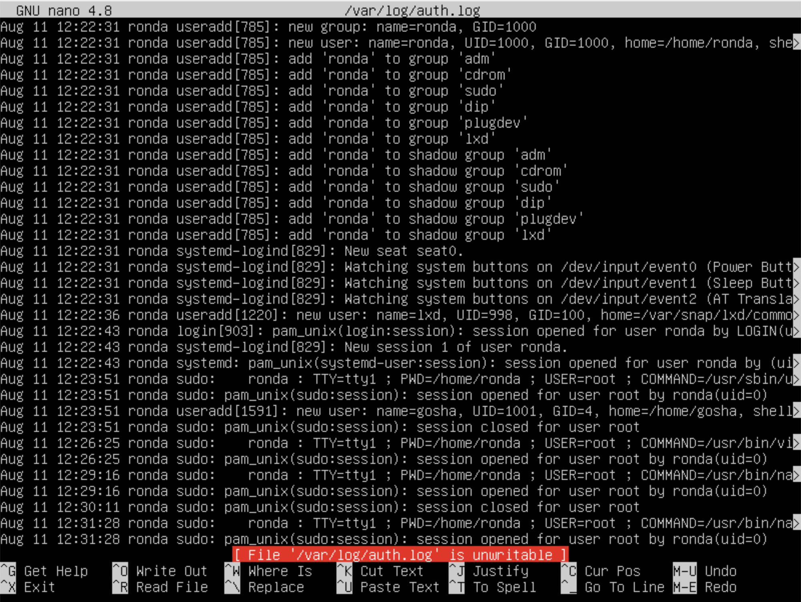
    - время последней успешной авторизации: Aug 11 12:22:43
    - имя пользователя: ronda
    - метод входа в систему: by login
- Перезапуск службы SSHd.
    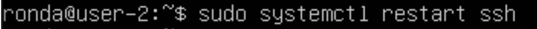
- Скрин с сообщением о рестарте службы:
    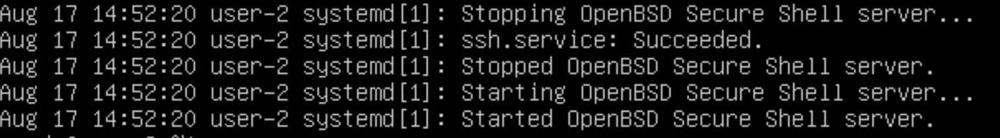
---
## Part 15. Использование планировщика заданий CRON
- Вход в `cron` для редактирования
    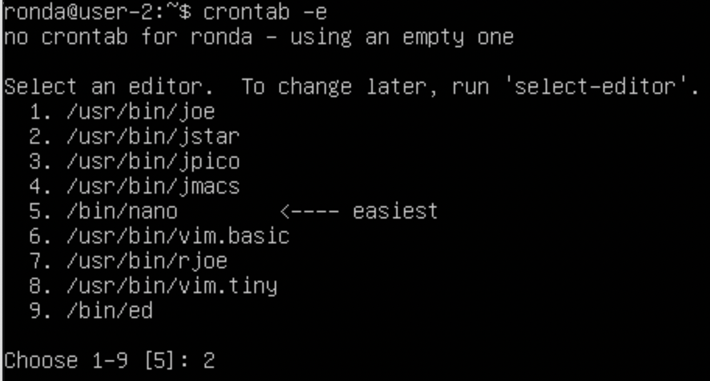
- Запуск команду uptime через каждые 2 минуты, использую планировщик задач.
    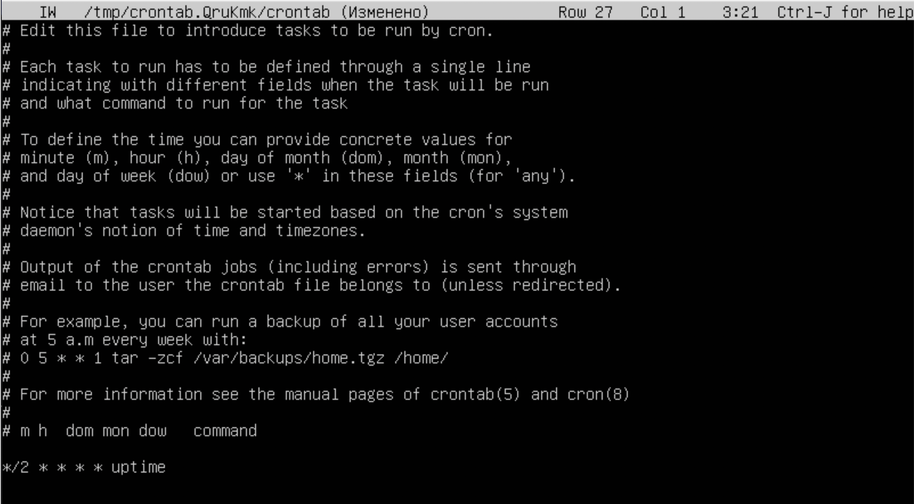
- Проверка в системных журналах выполнение команды.
    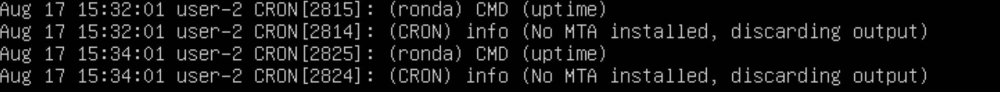
- Вывод списка текущих задач:
    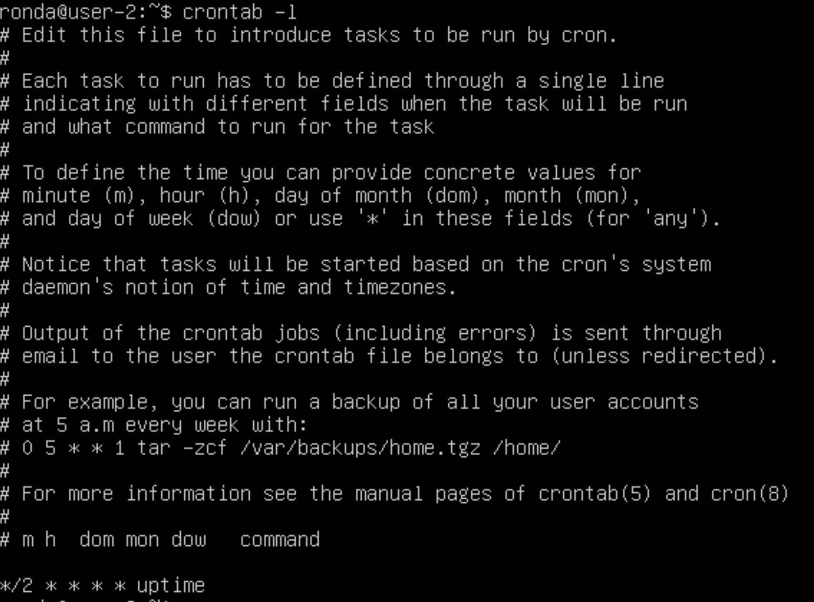
- Удаление всех заданий из планировщика заданий.
    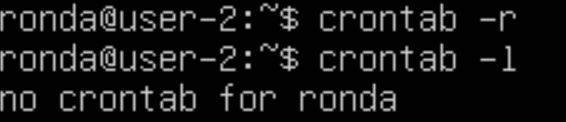
---