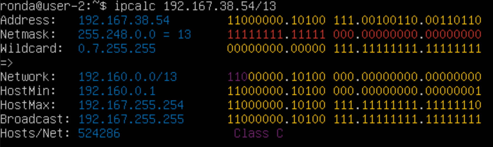
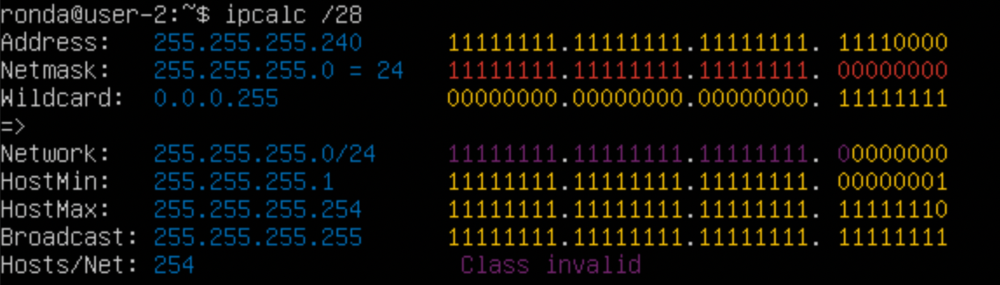
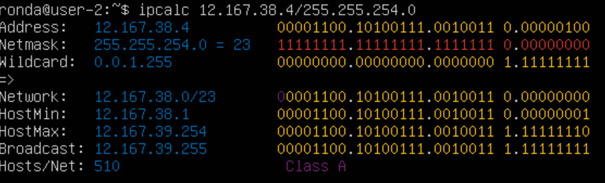
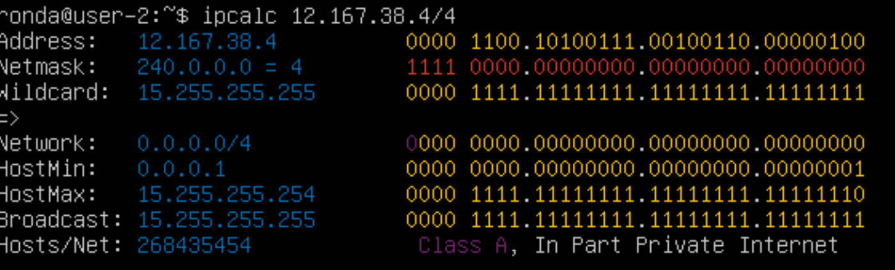
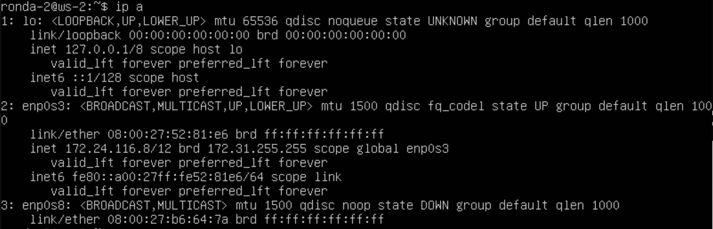
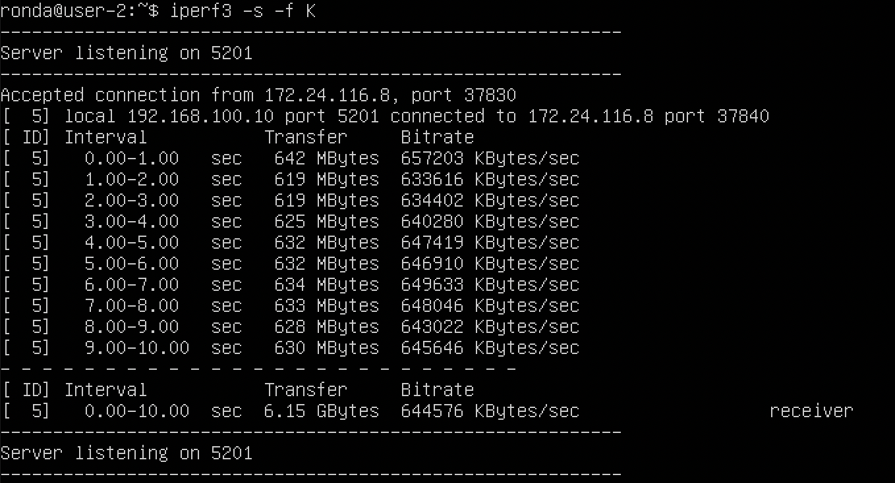
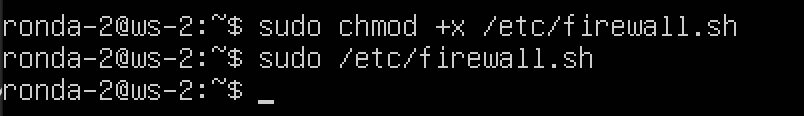
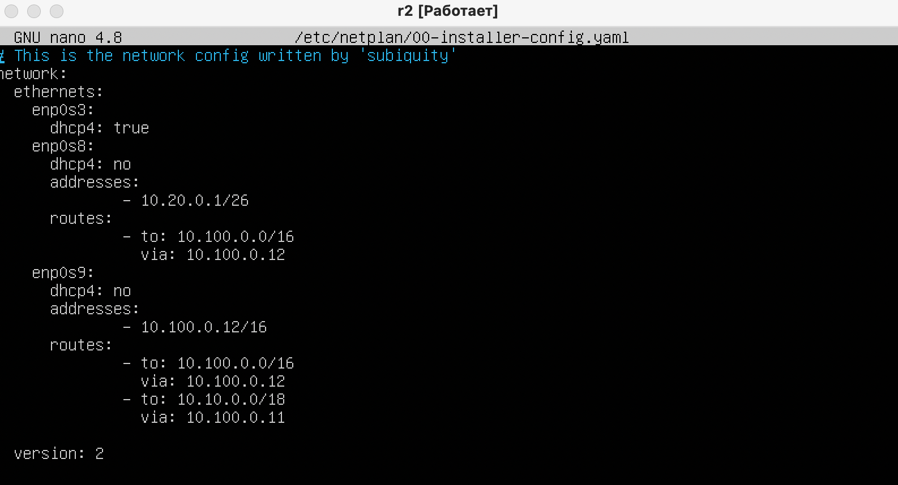
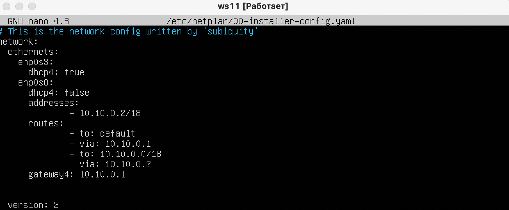

## Part 1. Инструмент ipcalc
#### 1.1. Сети и маски
- установка ipcalc 
    

- определение адреса сети 
    
    - адрес для сети 192.167.38.54/13: 192.160.0.0

- перевод маски 255.255.255.0
    
    - в префиксную : /24
    - в двоичную : 11111111.11111111.11111111.00000000

- перевод маски /15
    
    -  в обычную : 255.254.0.0
    - и двоичную : 11111111.11111110.00000000.00000000

- перевод маски 11111111.11111111.11111111.11110000
    
    - в обычную : 255.255.255.240
    - в префиксную : /28

- хост в сети 12.167.38.4 при маске: /8
    
    - минимальный хост : 12.0.0.1
    - максимальный хост : 12.255.255.254

- хост в сети 12.167.38.4 при маске: 11111111.11111111.00000000.00000000
    
    - минимальный хост : 12.167.0.1
    - максимальный хост : 12.167.255.254

- хост в сети 12.167.38.4 при маске: 255.255.254.0
    
    - минимальный хост : 12.167.38.1
    - максимальный хост :12.167.39.254

- хост в сети 12.167.38.4 при маске: /4
    
    - минимальный хост : 0.0.0.1 
    - максимальный хост : 15.255.255.254

#### 1.2. localhost
- обращение к адресам 194.34.23.100, 127.0.0.2, 127.1.0.1
    
- обращение к адресу 128.0.0.1
    
- можно обратиться к адресам 127.0.0.2 и 127.1.0.1 т.к. есть loopback обратная петля, адрес того компьютера с которого отправлен запрос.
Имя localhost как правило присвоено именно этому адресу.

#### 1.3. Диапазоны и сегменты сетей
- Публичные: 134.43.0.2, 172.0.2.1, 192.172.0.1, 192.169.168.1
- Частные: 10.0.0.45, 10.10.10.10, 192.168.4.2, 172.20.250.4, 172.68.0.2, 172.16.255.255
- Из перечисленных IP адресов шлюза возможны у сети 10.10.0.0/18: 10.10.0.2, 10.10.10.10, 10.10.100.1, 10.10.1.255
---
## Part 2. Статическая маршрутизация между двумя машинами
- просмотр существующих сетевых интерфейсов ws-1
    
- просмотр существующих сетевых интерфейсов ws-2
    
- установка адерса и маски на ws-1 и перезапуск сервиса сети
    
- установка адерса и маски на ws-2 и перезапуск сервиса сети
    
- проверка сетевых интерфесов для ws1
    
- проверка сетевых интерфесов для ws2
    

#### 2.1. Добавление статического маршрута вручную
- ws1 добавление маршрута до машины ws2 и пинг 
    
- ws2 добавление маршрута до машины ws1 и пинг
    

#### 2.2. Добавление статического маршрута с сохранением
- перезапуск машин через `sudo reboot`
- Добавление статического маршрута от одной машины до другой ws1
    
- Добавление статического маршрута от одной машины до другой ws2
    
- Пропинговал соединение между машинами для ws1
    
- Пропинговал соединение между машинами для ws2
    
---
## Part 3. Утилита iperf3
#### 3.1. Скорость соединения
- 8 Mbps в MB/s - 1 MB/s 
- 100 MB/s в Kbps - 100000 Kbps
- 1 Gbps в Mbps - 1000 Mbps

#### 3.2. Утилита iperf3
- установка iperf3 с помощью команды `sudo apt install iperf3`
- используем вм как сервер 

- Измерить скорость соединения между ws1 и ws2. 
 
---
## Part 4. Сетевой экран
#### 4.1. Утилита iptables
- добавление в файл правил 1,2,3,4,5 для ws1
    
- добавление в файл правил 1,2,3,4,5 для ws2
    
- запуск команд `chmod +x /etc/firewall.sh` и `/etc/firewall.sh` для ws1
    
- запуск команд `chmod +x /etc/firewall.sh` и `/etc/firewall.sh` для ws2
    
- Разница: iptables выполняет правила последовательно, соответсвенно ws1 не будет пинговаться, т.к. сначала идёт запрещающее правило. ws2 будет, т.к. сначала идёт разрешающее правило.

#### 4.2. Утилита nmap
- пинг машины  которая не "пингуется" (ws1)
    
- хост машины запущен
    
- дампы образов виртуальных машин
    
---
## Part 5. Статическая маршрутизация сети
#### 5.1. Настройка адресов машин
- настройка ws11
    
- настройка r1
    
- настройка r2
    
- настройка ws21
    
- настройка ws22
    
- проверка ws11
    
- проверка r1
    
- проверка r2
    
- проверка ws21
    
- проверка ws22
   
- пинг ws22 через ws21
    
- пинг r1 через ws11
    

#### 5.2. Включение переадресации IP-адресов.
- выполнение команды `sysctl -w net.ipv4.ip_forward=1` на r1
    
- выполнение команды `sysctl -w net.ipv4.ip_forward=1` на r2
    
- изменение  `/etc/sysctl.conf` на r1
    
- изменение  `/etc/sysctl.conf` на r1
    

#### 5.3. Установка маршрута по-умолчанию
- Настроийка маршрута по-умолчанию для ws11
    
- Настроийка маршрута по-умолчанию для ws21
    
- Настроийка маршрута по-умолчанию для ws22
    
- Вызов `ip r` для ws11
    
- Вызов `ip r` для ws21
    
- Вызов `ip r` для ws22
    
- Пропинговали с ws11 роутер r2 
    
- пинг доходит на r2
    

#### 5.4. Добавление статических маршрутов
- Добавить в роутеры r1 и r2 статические маршруты в файле конфигураций.
- для r1 
    
- для r2
    
- Вызвать ip r и показать таблицы с маршрутами на обоих роутерах.
- для r1 
    
- для r2
    
- Запускаем команды на ws11: ip r list 10.10.0.0/[маска сети] 
    
- и ip r list 0.0.0.0/0
    
- Для локальной подсети 10.10.0.0/18 у нас отдельный маршрут, чтобы пакеты не отправлялись на все остальные адреса, входящие в 0.0.0.0/0

#### 5.5. Построение списка маршрутизаторов
- Запустить на r1 команду дампа `tcpdump -tnv -i eth0`
    
- список маршрутизаторов на пути от ws11 до ws21
    
- Команда traceroute linux использует UDP пакеты. Она отправляет пакет с TTL=1 и смотрит адрес ответившего узла, дальше TTL=2, TTL=3 и так пока не достигнет цели. Каждый раз отправляется по три пакета и для каждого из них измеряется время прохождения. Когда утилита traceroute получает сообщение от целевого узла о том, что порт недоступен трассировка считается завершенной.

#### 5.6. Использование протокола ICMP при маршрутизации
- Запустиkb на r1 перехват сетевого трафика,
    
- Пропинговать с ws11 несуществующий IP
    
---
## Part 6. Динамическая настройка IP с помощью DHCP
- указать адрес маршрутизатора по-умолчанию для r2:
    
- в файле /etc/resolv.conf прописать `nameserver 8.8.8.8.`
    
- Перезагружаем службу DHCP командой `systemctl restart isc-dhcp-server`
    
- Через ip a показываем, что ws21 получила адрес:
    
- Пингуем ws21 с ws22:
    

- Указываем MAC адрес у ws11: `в etc/netplan/00-installer-config.yaml` добляем строки: `macaddress: 10:10:10:10:10:BA, dhcp4: true`
    
- Для r1 настраиваем в файле /etc/dhcp/dhcpd.conf конфигурацию службы DHCP: указываем адрес маршрутизатора по-умолчанию, DNS-сервер и адрес внутренней сети:
    
- в файле /etc/resolv.conf прописать nameserver 8.8.8.8.
    
- Перезагружаем службу DHCP командой systemctl restart isc-dhcp-server
    
- Через ip a показываем, что ws11 получила адрес:
    
- Пингуем ws22 с ws11:
    

- Через ip a показываем текущий адрес ws21: 
    
- Принудительного освобождаем IP-адрес DHCP-клиента с помощью команды  `sudo dhclient -r`
- Получаем новый IP-адрес с помощью DHCP с помощью команды `sudo dhclient`
    
- Через ip a показываем что адрес ws21 сменился:
    
- Какими опциями DHCP сервера пользовались в данном пункте:
Настройка конфигурации службы DHCP (адрес маршрутизатора по-умолчанию, DNS-сервер, адрес внутренней сети, привязка к MAC-адресу)
Клиент протокола динамической конфигурации хоста (команда dhclient) для обновления или освобождения IP-адреса
---
## Part 7. NAT
- В файле /etc/apache2/ports.conf на ws22 изменяем строку Listen 80 на Listen 0.0.0.0:80

- В файле /etc/apache2/ports.conf на и r1 изменяем строку Listen 80 на Listen 0.0.0.0:80

- проверка что сервер работает на ws22

- проверка что сервер работает на r1

- Создаем на r2 файл /etc/firewall.sh, имитирующий фаерволл
- Добавляем в фаервол следующие правила:

- Запускаем файл командами sudo chmod +x /etc/firewall.sh и sudo bash /etc/firewall.sh

- Проверяем соединение между ws22 и r1 командой ping, ws22 не должна "пинговаться" с r1

- Добавляем в фаервол следующие правила:

- выключаем NAT

- Запускаем файл командами sudo chmod +x /etc/firewall.sh и sudo bash /etc/firewall.sh

- Проверить соединение по TCP для SNAT, для этого с ws22 подключаемся к серверу Apache на r1 командой: telnet 10.10.0.1 80

- Проверяем соединение по TCP для DNAT, для этого с r1 подключаемся к серверу Apache на ws22 командой telnet 10.20.0.20 80

## Part 8. Дополнительно. Знакомство с SSH Tunnels
- Запускаем файл командами sudo chmod +x /etc/firewall.sh и sudo bash /etc/firewall.sh

- Запускаем веб-сервер Apache на ws22 только на localhost то есть в файле /etc/apache2/ports.conf меняем строку Listen 80 на Listen localhost:80

- Воспользуемся Local TCP forwarding с ws21 до ws22, чтобы получить доступ к веб-серверу на ws22 с ws21

- Воспользуемся Remote TCP forwarding c ws11 до ws22, чтобы получить доступ к веб-серверу на ws22 с ws11

